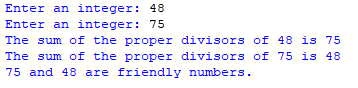
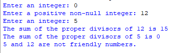

## Description 
This program allows users to input two positive integers, and determines whether they are "friendly numbers."  
Friendly numbers are pairs of integers where the sum of the proper divisors of one number is equal to the other number. The program calculates and displays the sum of the proper divisors (excluding 1) for each input integer and then provides a clear message indicating whether the two numbers are friendly or not.
## Example
♡ Example 1  
  
♡ Example 2    

